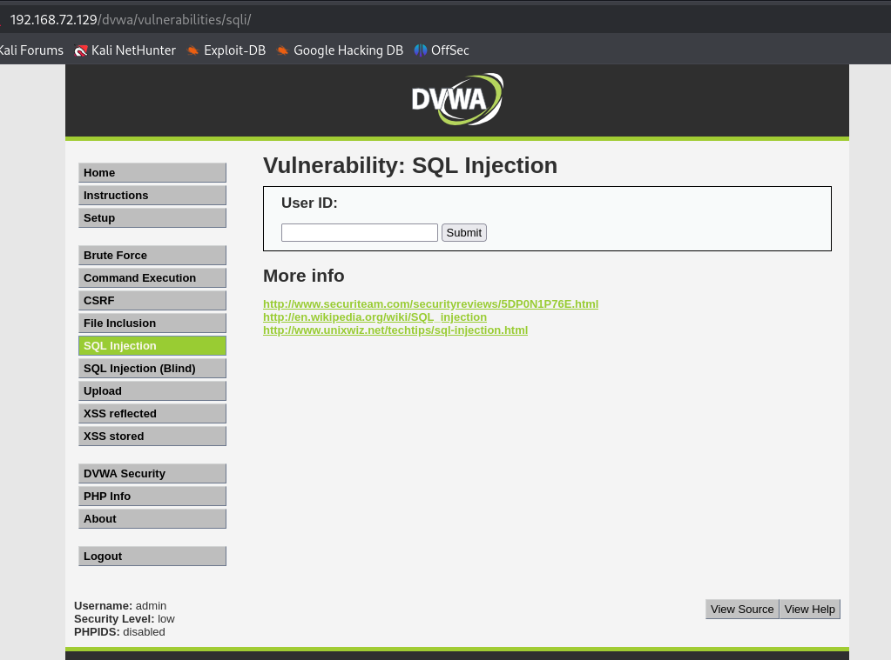
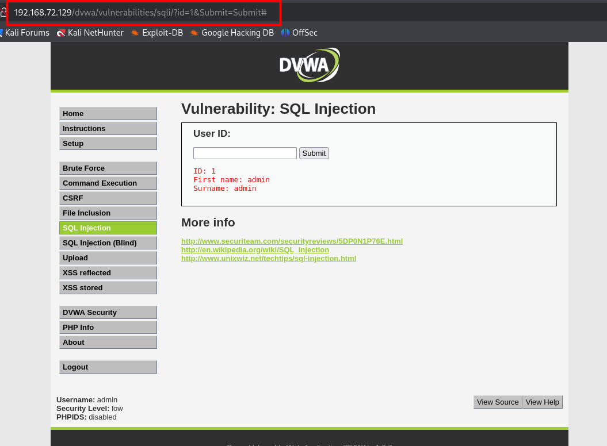
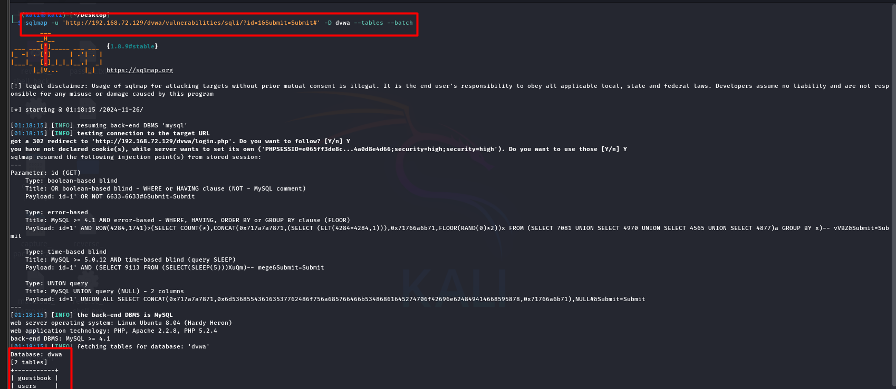
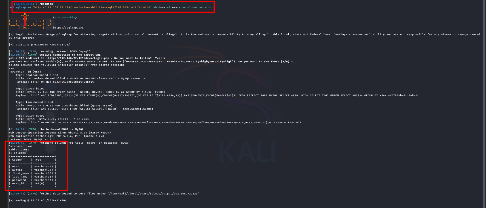
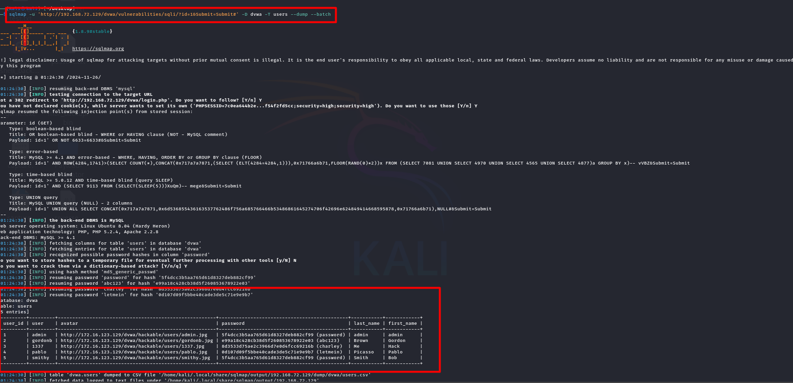

# Dump-Data-by-SQLMap

SQLmap is a powerful open-source tool designed to automate the detection and exploitation of SQL injection vulnerabilities in web applications. Here are its key features:

- Automated Detection: SQLmap can automatically identify SQL injection vulnerabilities by testing various parameters and payloads.

- Database Fingerprinting: It can determine the type of database management system (DBMS) in use, such as MySQL, PostgreSQL, Oracle, and SQLite.

- Data Extraction: SQLmap can extract a wide range of data from the database, including usernames, passwords, database names, tables, columns, and entire database content.

- Shell Access: In some cases, SQLmap can be used to obtain shell access to the underlying operating system for further exploitation and post-exploitation activities.

- Custom Payloads and Tamper Scripts: Users can customize injection payloads and use tamper scripts to bypass input filters and WAF (Web Application Firewall) protections.

- Support for Multiple Platforms: SQLmap supports various platforms and can be used with different types of HTTP requests (GET, POST, etc.) and methods (Burp Suite, ZAP, etc.).

Now, I am going to inject sql in DVWA application. 

Let's login to the DVWA and make its security low. 

 

Then give any input in the user id. I gave 1 and submit it. Then copy the url and go to the kali linux terminal

 

 

you can write sqlmap -h for see how this is work.

At first, i will find out the database name for this website.

 

After find the database name, now i am going to find out the tables name from database.

 

Now we are going to find out the columns name form the users table.

 
 Finally we are going to dump all the data of this columns and get all the information.

 
 

#### There are a lot of inforamtion you can find out by see the help page of sqlmap.

##### Good Luck :+1: